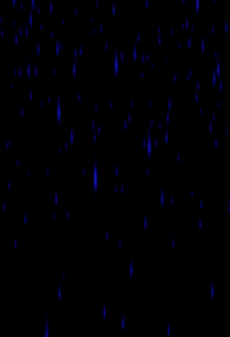

# @zappar/threejs-particle-system

This is a powerful JavaScript library for creating and managing particle emitters in 3D space using the `THREE` library. It gives you fine-grained control over particle behaviour, distribution, and appearance. With options for various emitter types, color, opacity, size, angle and many other parameters, this library allows you to simulate complex particle systems such as fire, smoke, stars, or even abstract visual effects.





## Key Features

- **Emitter Types**: Choose from 'BOX', 'SPHERE', 'DISC', or 'LINE' distributions to control the spawn position and force behaviour of the particles.
- **Particle Count and Duration**: Define the total number of particles an emitter holds and the duration for which the emitter lives. You can even specify emitters to run indefinitely.
- **Velocity and Acceleration**: Customise the base and variance of the velocity and acceleration of each particle.
- **Drag and Wiggle**: Apply drag to particles and make them wiggle over time. A great feature to simulate fire embers or create whimsical effects.
- **Rotation**: Static or dynamic rotation of particles around a defined axis of rotation, with optional randomisation on re-spawning.
- **Color and Opacity**: Define the color and opacity of a particle over its lifetime. - Both color and opacity support value-over-lifetime properties, meaning you can describe specific value changes over a particle's lifetime.
- **Size and Angle**: Adjust the size and angle of particles, both also support value-over-lifetime properties.
- **Texture and Blending**: Define the texture of particles.<!-- even supporting sprite-sheets for animated particles. --> Apply blending modes to enhance the visual appearance of your particles.
- **Billboarding**: Choose between spherical, cylindrical or directional billboarding for your different emitter effects.


You may also be interested in:

- Zapapr for three.js ([website](https://zap.works/universal-ar/threejs/), [NPM](https://www.npmjs.com/package/@zappar/zappar-threejs))
- Zappar for A-Frame ([website](https://zap.works/universal-ar/aframe/), [NPM](https://www.npmjs.com/package/@zappar/zappar-aframe))
- Zappar for React+three.js ([website](https://zap.works/universal-ar/react/), [NPM](https://www.npmjs.com/package/@zappar/zappar-react-three-fiber))
- Zappar for Unity ([website](https://zap.works/universal-ar/unity/))
- Zappar for JavaScript ([website](https://zap.works/universal-ar/aframe/), [NPM](https://www.npmjs.com/package/@zappar/zappar)), if you'd like to build content with a different 3D rendering platform
- ZapWorks Studio ([website](https://zap.works/studio/)), a full 3D development environment built for AR, VR and MR

## Getting Started

## Starting Development

You can use this library by installing from NPM for use in a module project.

### NPM Package

Run the following NPM command inside your project directory:

```bash
npm install --save @zappar/threejs-particle-system
```

Then import the library into your JavaScript or TypeScript files:

```ts
import * as ParticleSystem from "@zappar/threejs-particle-system";
```

### Example Project

<details>
  <summary>Click to reveal</summary>

  ```ts
import * as THREE from 'three';
import { OrbitControls } from "three/examples/jsm/controls/OrbitControls";
import * as ParticleSystem from "@zappar/threejs-particles";
import './index.css'

// Define the URL for the rain particle texture
const rainParticle = new URL('./rain-particle.png', import.meta.url).href;

// Initialize scene, camera and clock
const clock = new THREE.Clock();
const scene = new THREE.Scene();
const camera = new THREE.PerspectiveCamera(75, window.innerWidth / window.innerHeight, 0.01, 1000);

// Initialize renderer and append it to the body
const renderer = new THREE.WebGLRenderer();
renderer.setSize(window.innerWidth, window.innerHeight);
document.body.appendChild(renderer.domElement);

// Initialize camera controls
const controls = new OrbitControls(camera, renderer.domElement);

// Function to setup the EmitterGroup
const setupEmitterGroup = (billboard?: 'spherical' | 'cylindrical' | 'directional'): ParticleSystem.EmitterGroup => {
  // Create a new EmitterGroup
  const _emitterGroup = new ParticleSystem.EmitterGroup({
    billboard,
    maxParticleCount: 2000,
    texture: {value: new THREE.TextureLoader().load(rainParticle)}
  });

  // Define a new Emitter
  const emitter = new ParticleSystem.Emitter({
    particleCount: 200,
    size: { value: 2.0 },
    velocity: {
      value: new THREE.Vector3(0, 0, 0),
      spread: new THREE.Vector3(0, 0, 0)
    },
    acceleration: {
      value: new THREE.Vector3(0, 0, 0),
    },
    position: {
      value: new THREE.Vector3(0, 0, 0),
      spread: new THREE.Vector3(10, 10, 10)
    },
  });

  // Add the emitter to the group and set its position and scale
  _emitterGroup.addEmitter(emitter);
  _emitterGroup.mesh.position.set(0, 0, 0);
  _emitterGroup.mesh.scale.set(1, 1, 1);

  // Return the EmitterGroup
  return _emitterGroup;
}

// Initialize the EmitterGroup
const emitterGroup = setupEmitterGroup();

// Add the EmitterGroup to the scene
scene.add(emitterGroup.mesh);

// Set initial camera position
camera.position.z = 5;

// Define the animation loop
const animation = function () {
  // Update emitter group, controls and render the scene
  emitterGroup.tick(clock.getDelta());
  controls.update();
  renderer.render(scene, camera);
};

// Set the animation loop
renderer.setAnimationLoop(animation);

  ```

</details>

## Particle Emitter settings

| Name              | Type          | Default value       | Description |
| -----------       | -----------   | -----------   | ----------- |
| type | 'BOX' _or_ 'SPHERE' _or_ 'DISC' _or_ 'LINE' | 'BOX'      | The default distribution this emitter should use to control its particle's spawn position and force behaviour. |
| particleCount  | number        | 100   | The total number of particles this emitter will hold. NOTE: this is not the number of particles emitted in a second, or anything like that. The number of particles emitted per-second is calculated by particleCount / maxAge (approximately!) |
| duration  | number _or_ null       | null   | The duration in seconds that this emitter should live for. If not specified, the emitter will emit particles indefinitely. NOTE: When an emitter is older than a specified duration, the emitter is NOT removed from it's group, but rather is just marked as dead, allowing it to be reanimated at a later time using `ParticleEmitter.enable()`. |
| isStatic  | boolean       | false   | Whether this emitter should be be simulated. |
| activeMultiplier  | number > 0 _&_ < 1       | 1   | A value between 0 and 1 describing what percentage of this emitter's particlesPerSecond should be emitted, where 0 is 0%, and 1 is 100%. For example, having an emitter with 100 particles, a maxAge of 2, yields a particlesPerSecond value of 50. Setting `activeMultiplier` to 0.5, then, will only emit 25 particles per second (0.5 = 50%).Values greater than 1 will emulate a burst of particles, causing the emitter to run out of particles before it's next activation cycle. |
| direction | number 1 _or_ -1 | 1 | The direction of the emitter. If value is `1`, emitter will start at beginning of particle's lifecycle. If value is `-1`, emitter will start at end of particle's lifecycle and work it's way backwards. |
| **maxAge** | | | An object describing the particle's maximum age in seconds. |
| maxAge.value | number > 0 _&_ < 1  | 2 | A number between 0 and 1 describing the amount of maxAge to apply to all particles.|
| maxAge.spread | number | 0 | A number describing the maxAge variance on a per-particle basis.|
| **position** | | | An object describing this emitter's position. |
| position.value | THREE.Vector3 | x: 0, y: 0, z: 0 | A `THREE.Vector3` instance describing this emitter's base position. |
| position.spread | THREE.Vector3 | x: 0, y: 0, z: 0 | A `THREE.Vector3` instance describing this emitter's position variance on a per-particle basis. Note that when using a `SPHERE` or `DISC` distribution, only the x-component of this vector is used. When using a `LINE` distribution, this value is the endpoint of the `LINE`.
| position.spreadClamp | THREE.Vector3 | x: 0, y: 0, z: 0 | A `THREE.Vector3` instance describing the numeric multiples the particle's should be spread out over. Note that when using a `SPHERE` or `DISC` distribution, only the x-component of this vector is used. When using a `LINE` distribution, this property is ignored. |
| position.radius | number | 10 | This emitter's base radius. |
| position.radiusScale | THREE.Vector3 | x: 1, y: 1, z: 1 | A `THREE.Vector3` instance describing the radius's scale in all three axes. Allows a `SPHERE` or `DISC` to be squashed or stretched. |
| position.distribution | 'BOX' _or_ 'SPHERE' _or_ 'DISC' _or_ 'LINE' | value of `distribution` | A specific distribution to use when radiusing particles. Overrides the `type` option. |
| position.randomise | boolean | false | When a particle is re-spawned, whether it's position should be re-randomised or not. Can incur a performance hit. |
| **velocity** | | | An object describing this particle velocity. |
| velocity.value | THREE.Vector3 | x: 0, y: 0, z: 0 | A `THREE.Vector3` instance describing this emitter's base velocity. |
| velocity.spread | THREE.Vector3 | x: 0, y: 0, z: 0 | A `THREE.Vector3` instance describing this emitter's velocity variance on a per-particle basis. Note that when using a `SPHERE` or `DISC` distribution, only the x-component of this vector is used. |
| velocity.distribution | 'BOX' _or_ 'SPHERE' _or_ 'DISC' _or_ 'LINE' | value of `distribution` | A specific distribution to use when calculating a particle's velocity. Overrides the `type` option. |
| velocity.randomise | boolean | false | When a particle is re-spawned, whether it's velocity should be re-randomised or not. Can incur a performance hit. |
| **acceleration** | | | An object describing this particle's acceleration. |
| acceleration.value | THREE.Vector3 | x: 0, y: 0, z: 0 | A `THREE.Vector3` instance describing this emitter's base acceleration. |
| acceleration.spread | THREE.Vector3 | x: 0, y: 0, z: 0 | A `THREE.Vector3` instance describing this emitter's acceleration variance on a per-particle basis. Note that when using a `SPHERE` or `DISC` distribution, only the x-component of this vector is used. |
| acceleration.distribution | 'BOX' _or_ 'SPHERE' _or_ 'DISC' _or_ 'LINE' | value of `distribution` | A specific distribution to use when calculating a particle's acceleration. Overrides the `type` option. |
| acceleration.randomise | boolean | false | When a particle is re-spawned, whether it's acceleration should be re-randomised or not. Can incur a performance hit. |
| **drag** | | | An object describing this particle drag. Drag is applied to both `velocity` and `acceleration` values. |
| drag.value | number | 0 | A number between 0 and 1 describing the amount of drag to apply to all particles. |
| drag.spread | number | 0 | A number describing the drag variance on a per-particle basis. |
| drag.randomise | boolean | false | When a particle is re-spawned, whether it's drag should be re-randomised or not. Can incur a performance hit. |
| **wiggle** | | | This is quite a fun one! The values of this object will determine whether a particle will wiggle, or jiggle, or wave, or shimmy, or waggle, or... Well you get the idea. The wiggle is calculated over-time, meaning that a particle will start off with no wiggle, and end up wiggling about with the distance of the `value` specified by the time it dies. It's quite handy to simulate fire embers, or similar effects where the particle's position should slightly change over time, and such change isn't easily controlled by rotation, velocity, or acceleration. The wiggle is a combination of sin and cos calculations, so is circular in nature. |
| wiggle.value | number | 0 | A number describing the amount of wiggle to apply to all particles. It's measured in distance. |
| wiggle.spread |  number | 0 | A number describing the wiggle variance on a per-particle basis. |
| **rotation** | | | An object describing this emitter's rotation. It can either be static, or set to rotate from 0 radians to the value of `rotation.value` over a particle's lifetime. Rotation values affect both a particle's position and the forces applied to it. |
| rotation.axis | THREE.Vector3 | x: 0, y: 1, z: 0 | A `THREE.Vector3` instance describing this emitter's axis of rotation. |
| rotation.axisSpread | THREE.Vector3 | x: 0, y: 0, z: 0 | A `THREE.Vector3` instance describing the amount of variance to apply to the axis of rotation on a per-particle basis. |
| rotation.angle | number | 0 | The amount of variance in each particle's rotation angle. |
| rotation.angleSpread | number | 0 | The amount of variance in each particle's rotation angle. |
| rotation.static | boolean | false | Whether the rotation should be static or not. |
| rotation.center | THREE.Vector3 | value of `position.value` | A `THREE.Vector3` instance describing the center point of rotation. |
| rotation.randomise | boolean |  false | When a particle is re-spawned, whether it's rotation should be re-randomised or not. Can incur a performance hit. |
| **color** | | | An object describing a particle's color. This property is a "value-over-lifetime" property, meaning an array of values and spreads can be given to describe specific value changes over a particle's lifetime. Depending on the value of `valueOverLifetimeLength`, if arrays of `THREE.Color` instances are given, then the array will be interpolated to have a length matching the value of `valueOverLifetimeLength`. |
| color.value | THREE.Color _or_ THREE.Color array | r: 0, g: 0, b: 0 | Either a single `THREE.Color` instance, or an array of `THREE.Color` instances to describe the color of a particle over it's lifetime. |
| color.spread | THREE.Vector3 _or_ THREE.Vector3 array |  x: 0, y: 0, z: 0 | Either a single THREE.Vector3 instance, or an array of THREE.Vector3 instances to describe the color variance of a particle over it's lifetime. |
| color.randomise | boolean | false | When a particle is re-spawned, whether it's color should be re-randomised or not. Can incur a performance hit. |
| **opacity** | | | An object describing a particle's opacity. This property is a "value-over-lifetime" property, meaning an array of values and spreads can be given to describe specific value changes over a particle's lifetime. Depending on the value of `valueOverLifetimeLength`, if arrays of numbers are given, then the array will be interpolated to have a length matching the value of `valueOverLifetimeLength`. |
| opacity.value | number _or_ number array | 1 | Either a single number, or an array of numbers to describe the opacity of a particle over it's lifetime. |
| opacity.spread | number _or_ number array | 0 | Either a single number, or an array of numbers to describe the opacity variance of a particle over it's lifetime. |
| opacity.randomise | boolean | false | When a particle is re-spawned, whether it's opacity should be re-randomised or not. Can incur a performance hit. |
| **size** | | | An object describing a particle's size. This property is a "value-over-lifetime" property, meaning an array of values and spreads can be given to describe specific value changes over a particle's lifetime. Depending on the value of `valueOverLifetimeLength`, if arrays of numbers are given, then the array will be interpolated to have a length matching the value of `valueOverLifetimeLength`. |
| size.value | number _or_ number array | 1 | Either a single number, or an array of numbers to describe the size of a particle over it's lifetime. |
| size.spread | number _or_ number array | 0 | Either a single number, or an array of numbers to describe the size variance of a particle over it's lifetime. |
| size.randomise | boolean | false | When a particle is re-spawned, whether it's size should be re-randomised or not. Can incur a performance hit. |
| **angle** | | | An object describing a particle's angle. The angle is a 2d-rotation, measured in radians, applied to the particle's `texture`. NOTE: if a particle's `texture` is a sprite-sheet, this value **IS IGNORED**. This property is a "value-over-lifetime" property, meaning an array of values and spreads can be given to describe specific value changes over a particle's lifetime. Depending on the value of `valueOverLifetimeLength`, if arrays of numbers are given, then the array will be interpolated to have a length matching the value of `valueOverLifetimeLength`. |
| angle.value | number _or_ number array | 0 | Either a single number, or an array of numbers to describe the angle of a particle over it's lifetime. |
| angle.spread | number _or_ number array | 0 | Either a single number, or an array of numbers to describe the angle variance of a particle over it's lifetime. |
| angle.randomise | boolean | false | When a particle is re-spawned, whether it's angle should be re-randomised or not. Can incur a performance hit. |

## Particle Group settings

| Name              | Type          | Default value       | Description |
| -----------       | -----------   | -----------   | ----------- |
| **texture** | | | An object describing the texture used by the group. |
| texture.value | THREE.Texture _or_ null | null | An instance of `THREE.Texture`. |
| texture.frames | THREE.Vector2 | x: 1, y: 1 | A `THREE.Vector2` instance describing the number of frames on the x- and y-axis of the given texture. If not provided, the texture will NOT be treated as a sprite-sheet and as such will NOT be animated. |
| texture.frameCount | number | value of `texture.frames.x` * value of `texture.frames.y`| The total number of `frames` in the sprite-sheet. Allows for sprite-sheets that don't fill the entire `texture`. |
| texture.loop | number | 1 | The number of loops through the sprite-sheet that should be performed over the course of a single particle's lifetime. |
| fixedTimeStep | number | 0.016 | If no `dt` (or `deltaTime`) value is passed to this group's `tick()` function, this number will be used to move the particle simulation forward. Value in SECONDS. |
| hasPerspective | boolean | true | Whether the distance a particle is from the camera should affect the particle's size. |
| colorize | boolean | true | Whether the particles in this group should be rendered with color, or whether the only color of particles will come from the provided texture. |
| blending | THREE.Blending | AdditiveBlending | A `THREE.Blending` mode to be applied to this group's `ShaderMaterial`. |
| transparent | boolean | true | Whether these particle's should be rendered with transparency. |
| alphaTest | number > 0 _&_ < 1  | 0 | Sets the alpha value to be used when running an alpha test on the `texture.value` property. Value between 0 and 1. |
| depthWrite | boolean | false | Whether rendering the group has any effect on the depth buffer. |
| depthTest | boolean | true | Whether to have depth test enabled when rendering this group. |
| fog | boolean | true | Whether this group's particles should be affected by their scene's fog. |
| scale | number | 300 | The scale factor to apply to this group's particle sizes. Useful for setting particle sizes to be relative to renderer size. |
| maxParticleCount | number _or_ null | null | WARNING: If no `maxParticleCount` specified adding emitters after rendering will probably cause errors. |

## Links and Resources

* [Website](https://zap.works/universal-ar/)
- [Forum](https://forum.zap.works/)
